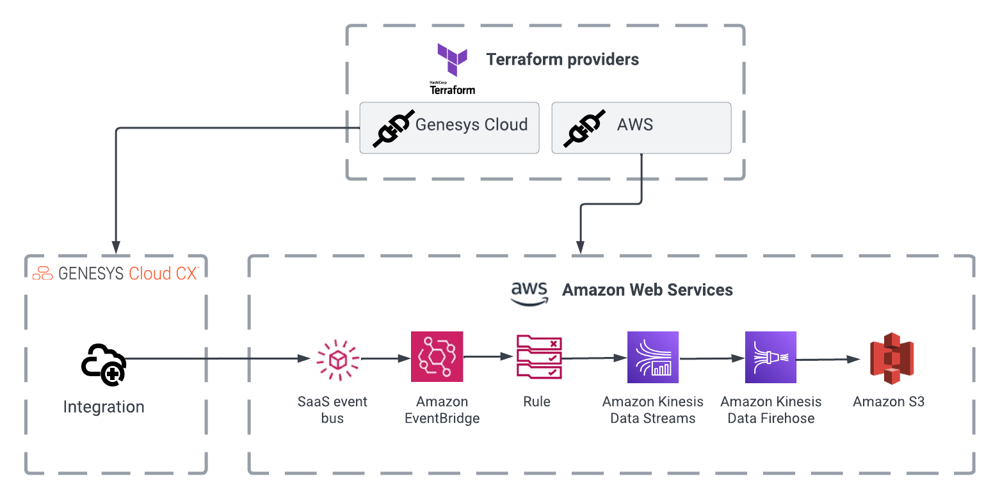

# AWS EventBridge - Write Analytics detail events to S3

This Genesys Cloud Developer Blueprint provides an example of a complete Terraform configuration that creates a Genesys Cloud EventBridge integration and writes events from the integration into S3.

.
