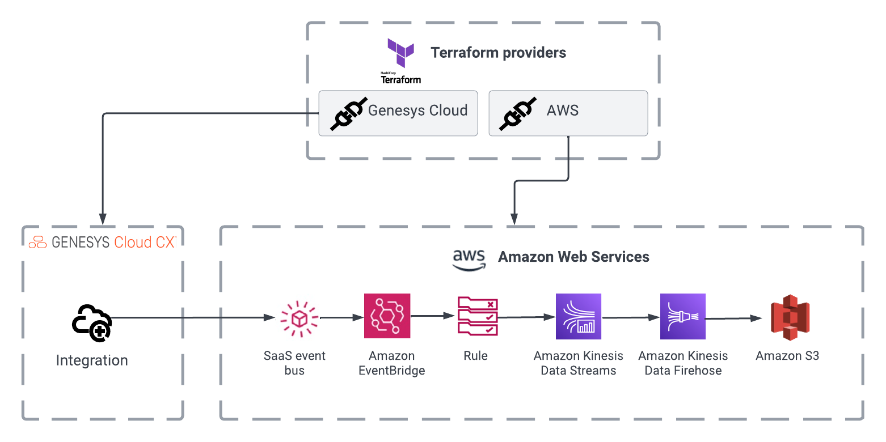

:::{"alert":"primary","title":"About Genesys Cloud Blueprints","autoCollapse":false} 
Genesys Cloud blueprints were built to help you jump-start building an application or integrating with a third-party partner. 
Blueprints are meant to outline how to build and deploy your solutions, not a production-ready turn-key solution.
 
For more details on Genesys Cloud blueprint support and practices 
please see our Genesys Cloud blueprint [FAQ](https://developer.genesys.cloud/blueprints/faq)sheet.
:::

This Genesys Cloud Developer Blueprint provides an example of a complete Terraform configuration that creates a Genesys Cloud EventBridge integration and writes events from the integration into S3. This solution can be extended to use Athena to analyze the data in S3, or the S3 destination could be replaced with OpenSearch to use the many features it provides for text-search, analytics, business intelligence, and so on.

## Solution

A scalable, serverless event bus that streams real-time data to selected targets based on custom routing rules.



# Contents

* [Solution components](#solution-components "Goes to the Solutions components section")
* [Prerequisites](#prerequisites "Goes to the Prerequisites section")
* [Implementation steps](#implementation-steps "Goes to the Implementation steps section")
* [Additional resources](#additional-resources "Goes to the Additional resources section")

## Solution components

* [Genesys Cloud CX](https://www.genesys.com/genesys-cloud "Goes to Genesys Cloud CX page") - A suite of Genesys Cloud services for enterprise-grade communications, collaboration, and contact center management.
* [Terraform](https://www.terraform.io/ "Goes to the Terraform page") - An open-source framework for managing cloud- and prem-based infrastructure services via a CLI.
* [CX as Code](https://developer.genesys.cloud/api/rest/CX-as-Code/ "Goes to the CX as Code page") - A tool to declaratively manage Genesys Cloud resources and configuration across organizations using Terraform.
* [AWS Terraform Provider](https://registry.terraform.io/providers/hashicorp/aws/latest/docs "Goes to the AWS Terraform Provider page") - Life cycle management of AWS resources, including EC2, Lambda, EKS, ECS, VPC, S3, RDS, DynamoDB, and more.
* [Amazon EventBridge](https://aws.amazon.com/eventbridge/ "Goes to the Amazon EventBridge page") - A scalable, serverless event bus that streams real-time data to selected targets based on custom routing rules.

## Prerequisites

### Specialized knowledge

* AWS Cloud Practitioner-level knowledge of AWS IAM, AWS EventBridge, AWS Kinesis, and AWS S3
* Experience using Terraform or similar infrastructure-as-code tools

### Genesys Cloud account

* A Genesys Cloud license. For more information see, [Genesys Cloud pricing](https://www.genesys.com/pricing "Goes to the Genesys Cloud pricing page") on the Genesys Cloud website.

### AWS user account

* An administrator account with permissions to access the following services.
  * AWS Identity and Access Management (IAM)
  * AWS Lambda
* AWS credentials. For more information about setting up your AWS credentials on your local machine, see [The shared config and credentials files](https://docs.aws.amazon.com/sdkref/latest/guide/file-format.html "Goes to the Shared AWS config and credentials files article") on the AWS page.

### Third-party software

* Terraform version 1.0.0 or later. For more information see, [Download Terraform](https://www.terraform.io/downloads "Goes to the Download Terraform Windows binary download page") on the Terraform website.

## Implementation steps

* [Clone the repository that contains the project files](#clone-the-repository-that-contains-the-project-files "Goes to the Clone the repository that contains the project files section")
* [Set up your AWS and Genesys Cloud credentials](#setup-your-aws-and-genesys-cloud-credentials "Goes to the Set up your AWS and Genesys Cloud credentials section")
* [Edit the configuration files](#edit-the-configuration-files  "Goes to the Edit the configuration files section")
* [Deploy the application](#deploy-the-application "Goes to the Deploy the application section")
* [Initiate a conversation](#initiate-a-conversation "Goes to the Initiate a conversation section")
* [View S3 bucket contents](#view-s3-bucket-contents "Goes to the View S3 bucket contents section")

### Clone the repository that contains the project files

Clone the [aws-eventbridge-analytics-detail-events-blueprint](https://github.com/GenesysCloudBlueprints/aws-eventbridge-analytics-detail-events-blueprint "Goes to the aws-eventbridge-analytics-detail-events-blueprint") on the GitHub repository page.

### Set up your AWS and Genesys Cloud credentials

To run this project using the AWS and Genesys Cloud Terraform provider, open a terminal window, set the following environment variables, and then run Terraform in the window where the following environment variables are set.

* `GENESYSCLOUD_OAUTHCLIENT_ID` - This environment variable is the Genesys Cloud client credential grant Id that CX as Code performs. 
* `GENESYSCLOUD_OAUTHCLIENT_SECRET` - This environment variable is the Genesys Cloud client credential secret that CX as Code performs. 
* `GENESYSCLOUD_REGION` - This environment variable is the Genesys Cloud region in which your organization is located.
* `AWS_ACCESS_KEY_ID` - Set up the AWS Access Key in your Amazon account to allow the AWS Terraform provider to act against your account.
* `AWS_SECRET_ACCESS_KEY` - Set up this environment variable in your Amazon account to allow the AWS Terraform provider to act against your account.

**Note:** The Genesys Cloud OAuth Client was given the master admin role for this project. 

### Edit the configuration files

1. Edit `blueprint/terraform/terraform.tfvars` and provide your AWS account region in `aws_account_region` in your local copy of the [aws-eventbridge-analytics-detail-events-blueprint](https://github.com/GenesysCloudBlueprints/aws-eventbridge-analytics-detail-events-blueprint "Goes to the aws-eventbridge-analytics-detail-events-blueprint repository page") in the GitHub repository. Feel free to edit other variables.

### Deploy the application

2. From the repo root, run the following command to initialize the Terraform providers.

```
terraform init
```

3. To deploy the application, run the following command. To apply the changeset, enter 'yes' when prompted.

```
terraform apply
```

### Initiate a conversation

There are several ways to initiate a conversation to generate detailed events for this integration. The easiest way is to use the [Web Chat Dev Tool](https://developer.genesys.cloud/developer-tools/#/webchat). For instructions on how to do this see, [Web Chat Dev Tool Guide](https://developer.genesys.cloud/guides/quickstarts/developer-tools-web-chats).

If you follow the guide, skip step 6.

### View S3 bucket contents

:::primary
The buffering interval has been set to 60 seconds, the lowest possible value. For this reason, it takes at least 60 seconds for the subscribed conversation detail events to be written to the bucket sometimes; this takes a few minutes.

After 60 seconds has elapsed from initiating the conversation, view the bucket contents in the AWS console. The bucket name is `conversation-detail-events-bucket` if `s3_bucket_name` in `blueprint/terraform/terraform.tfvars` has not changed. The events are stored in a file under `conversation-detail-events/YYYY/MM/DD/HH/`.

## Additional resources

* [What is Terraform?](https://www.terraform.io/intro "Goes to the What is Terraform page") on the Terraform website.
* [What is Amazon Athena](https://docs.aws.amazon.com/athena/latest/ug/what-is.html "Goes to the What is Amazon Athena? page") on the AWS website.
* [What Is OpenSearch?](https://aws.amazon.com/opensearch-service/the-elk-stack/what-is-opensearch/ "Goes to the What is OpenSearch? page") on the AWS website.
* [What Is Amazon EventBridge?](https://docs.aws.amazon.com/eventbridge/latest/userguide/eb-what-is.html "Goes to the What Is Amazon EventBridge? page") on the AWS website.
* The [aws-eventbridge-analytics-detail-events-blueprint](https://github.com/GenesysCloudBlueprints/aws-eventbridge-analytics-detail-events-blueprint "Goes to the aws-eventbridge-analytics-detail-events-blueprint repository page") in the GitHub repository.
[Amazon EventBridge integration](https://developer.genesys.cloud/api/rest/v2/notifications/event_bridge "Goes to the Amazon EventBridge integration page") on the Developer Center page.
